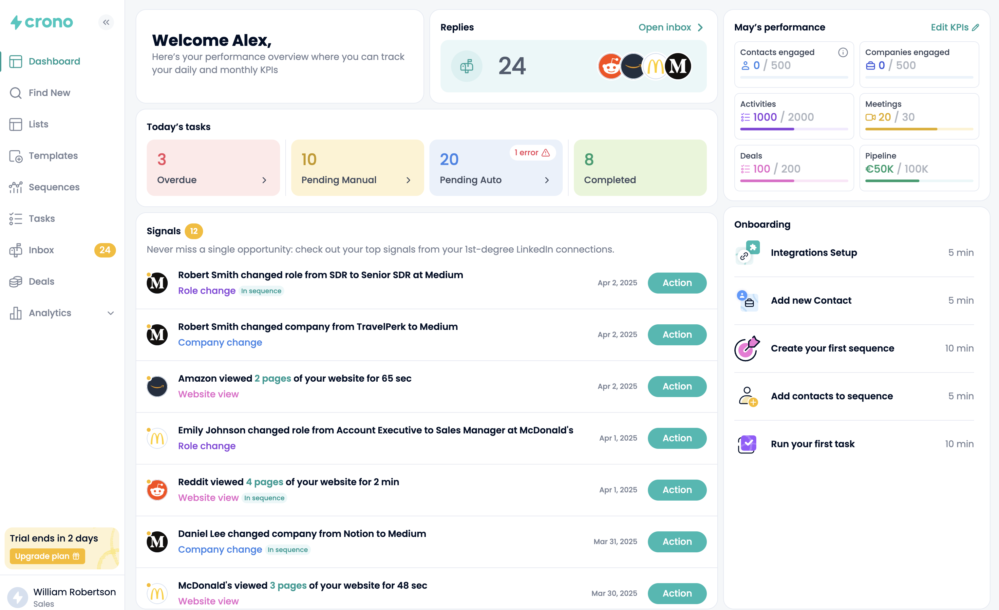
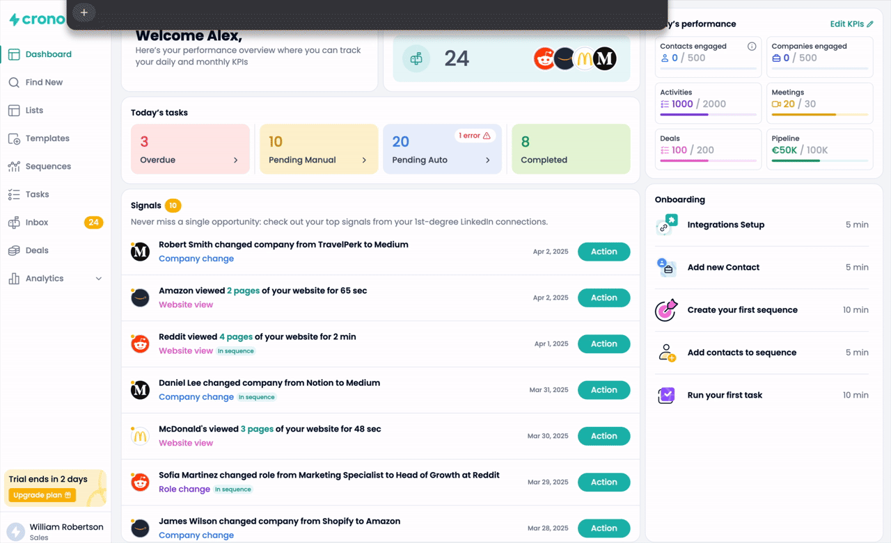
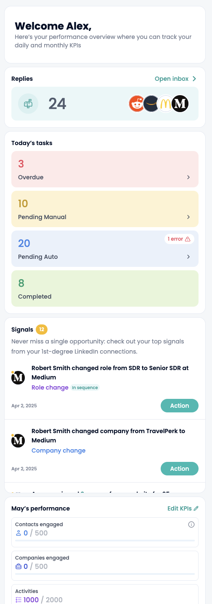

# Crono Dashboard – Frontend Technical Assessment

A responsive dashboard built with React and TypeScript from the provided Crono Figma design.

The implementation focuses on visual fidelity, responsive behavior, asynchronous data handling, and a production-oriented frontend architecture while keeping the scope appropriate for a technical assessment.

## Live Demo

[View the live application](https://crono-dashboard-alpha.vercel.app/)

## Visual Overview

### Dashboard



### Async Loading & Signals Interaction



### Responsive Layout



---

## Key Technical Highlights

- Responsive implementation based on the supplied Figma design
- Feature-oriented architecture with explicit API boundaries
- Asynchronous server state managed with TanStack Query
- Runtime API response validation with Zod
- Optimistic Signal mutations with rollback behavior
- Independent concurrent mutations without a global loading lock
- Protection against duplicate mutations on the same Signal
- Loading and error handling across async domains, with explicit retry flows for Performance and Signals
- Accessible interactions built on native semantics and Radix UI
- Focused component, integration, mutation, and API-boundary tests

## Tech Stack

- React
- TypeScript (strict mode)
- Vite
- Tailwind CSS v4
- TanStack Query
- Radix UI
- Zod
- Vitest
- React Testing Library
- Sonner
- Number Flow

## Architecture

The application is organized by responsibility rather than around a single component hierarchy.

```text
src/
├── api/
│   ├── performance/
│   ├── replies/
│   ├── signals/
│   ├── tasks/
│   └── utils.ts
├── app/
│   ├── App.tsx
│   └── providers.tsx
├── features/
│   └── dashboard/
│       ├── onboarding/
│       ├── performance/
│       ├── replies/
│       ├── signals/
│       ├── tasks/
│       └── welcome/
├── pages/
│   └── dashboard/
├── test/
├── ui/
└── styles/
```

### Layer Responsibilities

- **`api/`** contains data contracts, runtime schemas, mock services, and TanStack Query hooks.
- **`features/`** contains domain-specific dashboard UI and presentation logic.
- **`pages/`** composes features into the dashboard and contains page-specific elements such as the sidebar.
- **`ui/`** contains small reusable UI primitives that are not tied to a specific feature.
- **`app/`** owns application-level providers and bootstrap concerns.
- **`test/`** contains shared test infrastructure.

This keeps feature components independent from the underlying data source and avoids mixing API behavior with presentation code.

## Signals Architecture

Signals contain the main interactive workflow of the dashboard.

Both **Complete** and **Delete** are asynchronous operations. From the perspective of this dashboard, either action removes the corresponding Signal from the visible list.

### Optimistic Updates

Optimistic feedback is used to keep Signal actions feeling immediate. The user does not need to wait for the simulated API round trip before seeing the result of an action, while the application still preserves the ability to recover cleanly if the operation fails.

Pending Signal IDs are tracked independently from the query data.

When an action starts:

1. The Signal ID enters the pending mutation set.
2. The UI derives its visible rows by excluding pending IDs.
3. The Signal disappears immediately and the visible counter updates.
4. The cached Signal data remains unchanged while the request is pending.

On success, only the successfully mutated Signal is removed from the query cache.

On failure, the pending mutation ends while the original cached data is still available, so the Signal automatically becomes visible again.

This provides rollback behavior without maintaining and restoring manual cache snapshots.

### Concurrent Mutations

Mutations are intentionally independent.

Actions on different Signals can be in flight simultaneously without locking the entire list. A synchronous per-ID guard prevents duplicate operations from being started for the same Signal while its current mutation is unresolved.

The visible Signal count is derived from the currently visible rows rather than maintained as separate application state, keeping the list and counter consistent even when multiple operations resolve in a different order.

## Data Layer

> **The backend is mocked; the frontend architecture is not.**

Although the assessment uses local fixture data, data access is structured around a replaceable API boundary.

```text
Mock data
    ↓
Async service
    ↓
Zod validation
    ↓
TanStack Query
    ↓
Feature UI
```

Feature components never consume fixtures directly.

Mock services expose asynchronous operations where real HTTP requests could later be introduced. Responses are validated with Zod before entering the application, providing runtime guarantees in addition to TypeScript's compile-time types.

TanStack Query owns asynchronous server state, caching, request lifecycle, and mutation state. Data shared by different parts of the UI, such as the unread Replies count, can therefore use the same cached source of truth.

All assessment queries use `staleTime: Infinity` because the fixed mock datasets do not change independently, so stale-driven refetches would provide no new information. This is an assessment-specific decision rather than a universal production caching policy.

A short fixed API delay is intentionally included in the mock layer so loading and asynchronous interaction states can be exercised rather than existing only theoretically.

## Testing Strategy

Tests focus on behavior and architectural boundaries rather than implementation details or visual snapshots.

Coverage includes:

- shared UI component contracts
- dashboard composition
- feature success, zero-value, loading, and error states
- retry and recovery flows
- API response validation
- Signal Complete and Delete operations
- optimistic disappearance and count updates
- failed mutation rollback
- concurrent mutations on different Signals
- duplicate mutation protection for the same Signal
- shared query-cache behavior between consumers
- domain-specific formatting and presentation utilities

API-boundary tests deliberately provide malformed fixture data and verify that the service layer rejects it through the real Zod schemas.

Signals integration tests use controlled promises to verify intermediate optimistic states, rollback, and concurrent mutation ordering without relying on arbitrary timing delays.

A pre-push quality gate runs linting, TypeScript checks, and the full test suite before changes are pushed.

## Architecture Decisions & Trade-offs

### Server State vs. Global Client State

Redux, Zustand, or another global client-state store was intentionally not introduced.

Most dynamic state in this dashboard represents asynchronous server data, which is handled by TanStack Query. Local UI state remains close to the component that owns it.

Adding another global state layer would duplicate responsibilities without solving a current requirement.

### Runtime Validation

TypeScript cannot guarantee the shape of data received at runtime.

Zod validation is therefore performed at the service boundary. The current source happens to be controlled mock data, but the same boundary remains useful if those services are later replaced with real HTTP requests.

Types are derived from the schemas where appropriate to keep runtime and compile-time contracts aligned.

### Performance KPI Modeling

Performance KPI definitions, including their labels and ordering, are modeled as API-driven data rather than hardcoded UI configuration.

This keeps the implementation compatible with a potentially configurable KPI set suggested by the **Edit KPIs** control in the supplied design, without assuming how that functionality would ultimately be implemented.

### Vite and Application Scope

Vite was used rather than introducing a full-stack framework because the assessment is a client-side dashboard with no SSR, SEO, or server-routing requirements.

Likewise, no router or additional application-state infrastructure is introduced where the current scope does not require it.

The goal is to keep the architecture extensible without adding abstractions for hypothetical requirements.

## Responsive Design

The supplied **1440 × 750** Figma design is the primary fidelity target.

The layout progressively adapts at smaller widths rather than simply scaling the desktop composition:

- At `xl`, the dashboard uses the intended two-column desktop composition.
- Below `md`, the sidebar is hidden because no mobile navigation pattern was supplied.
- Relevant internal grids reflow at `sm` to preserve usable card proportions.
- Below `xl`, Signals uses a bounded height with internal scrolling while the page otherwise scrolls naturally.

The supplied design does not define a mobile navigation pattern, so the implementation does not invent one outside the assessment scope.

## Loading and Error Strategy

Async states are treated as part of feature behavior rather than generic placeholders.

All async domains expose loading and error handling. Performance and Signals display explicit error states with Retry actions, while Tasks and Replies use the compact unavailable state (`—`) when their requests fail.

Compact values follow a simple semantic distinction:

- `0` means the request succeeded and the actual value is zero.
- `—` means the value is unavailable because its request failed.
- Empty collections represent successful requests with no items.

Automatic query retries are disabled so failures remain deterministic. The Performance and Signals retry actions explicitly re-run their corresponding requests and expose loading state while the new request is unresolved.

## Production Considerations

### Scaling the Signals List

The current small Signal dataset does not require pagination or virtualization. At production scale, cursor pagination could be introduced through TanStack Query's infinite-query model, with virtualization added if the rendered DOM size became significant.

### Real API Integration

The current services can be replaced with HTTP implementations while preserving the feature-facing query architecture.

A production integration could additionally introduce concerns such as authentication, backend-specific error normalization, request cancellation where useful, and observability. These are intentionally outside the scope of the mocked assessment API.

## Getting Started

### Prerequisites

- Node.js 24, as selected by `.nvmrc`
- npm

The package engine also supports Node `^22.13.0` or `>=24.0.0`.

### Install Dependencies

```bash
npm ci
```

### Start Development

```bash
npm run dev
```

## Quality Checks

Run the complete local quality gate:

```bash
npm run check
```

This runs:

- ESLint
- TypeScript type checking
- Vitest

The production build remains a separate release check:

```bash
npm run build
```

The generated production build can be inspected locally with:

```bash
npm run preview
```

The production JavaScript bundle can be inspected with an interactive visualization using:

```bash

npm run analyze
```

Individual checks can also be run separately:

```bash
npm run lint
npm run typecheck
npm run test
```

A Husky pre-push hook runs the standard quality checks before pushing changes.

GitHub Actions runs the same quality gate on `push` and `pull_request` in a clean environment using the Node version selected by `.nvmrc`. The production build remains a separate release check.

## Scope and Assumptions

Where product behavior was not defined by the assessment or supplied design, the implementation favors the smallest predictable behavior rather than inventing additional requirements.

Notable assumptions include:

- **Complete** and **Delete** both remove a Signal from the current dashboard view.
- The Signals badge represents the currently visible Signal count.
- Performance KPI definitions are treated as API-driven data.
- Onboarding is static because no persistence or progression behavior was specified.
- Mobile navigation is not introduced because no corresponding design or interaction was supplied.
